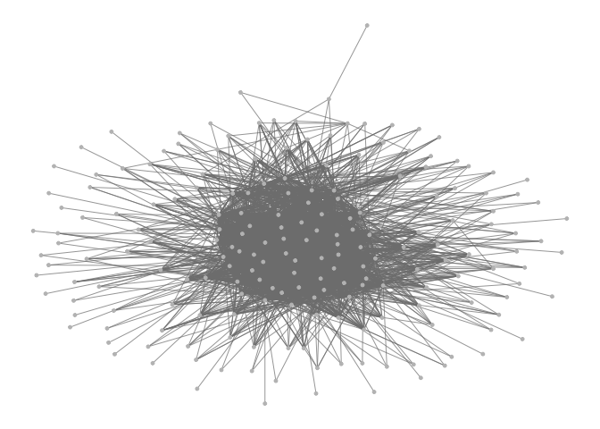

clean\_analysis
================

# Importing data

``` r
vday_green_taxi <- read_csv("./data/vday_green_taxi.csv")
```

    ## Parsed with column specification:
    ## cols(
    ##   .default = col_double(),
    ##   pickup_date = col_date(format = ""),
    ##   pickup_time = col_time(format = ""),
    ##   dropoff_date = col_date(format = ""),
    ##   dropoff_time = col_time(format = ""),
    ##   store_and_fwd_flag = col_character(),
    ##   ehail_fee = col_logical()
    ## )

    ## See spec(...) for full column specifications.

``` r
vday_yellow_taxi <- read_csv("./data/vday_yellow_taxi.csv")
```

    ## Parsed with column specification:
    ## cols(
    ##   .default = col_double(),
    ##   pickup_date = col_date(format = ""),
    ##   pickup_time = col_time(format = ""),
    ##   dropoff_date = col_date(format = ""),
    ##   dropoff_time = col_time(format = ""),
    ##   store_and_fwd_flag = col_character()
    ## )
    ## See spec(...) for full column specifications.

``` r
vday_for_hire_vehicle <- read_csv("./data/vday_for_hire_vehicle.csv")
```

    ## Parsed with column specification:
    ## cols(
    ##   hvfhs_license_num = col_character(),
    ##   dispatching_base_num = col_character(),
    ##   pickup_date = col_date(format = ""),
    ##   pickup_time = col_time(format = ""),
    ##   dropoff_date = col_date(format = ""),
    ##   dropoff_time = col_time(format = ""),
    ##   pu_location_id = col_double(),
    ##   do_location_id = col_double(),
    ##   sr_flag = col_double()
    ## )

# Filtering for Uber and Lyft Post Cleaned Data

``` r
vday_for_hire_vehicle <- vday_for_hire_vehicle %>% 
  filter(hvfhs_license_num %in% c("HV0003", "HV0005"))
```

# Sampling datasets

``` r
yellow_taxi_vday_samp <- sample_frac(vday_yellow_taxi, size = 0.1) %>% 
  mutate(type = "yellow")
green_taxi_vday_samp <- sample_frac(vday_green_taxi, size = 0.2) %>% 
  mutate(type = "green")
for_hire_vday_samp <- sample_frac(vday_for_hire_vehicle, size = 0.1) %>% 
  mutate(type = "for hire")
```

# Merge datasets

``` r
zone = read_csv("./data/taxi_zones.csv")
```

    ## Parsed with column specification:
    ## cols(
    ##   zone_id = col_double(),
    ##   borough = col_character(),
    ##   zone = col_character(),
    ##   x = col_double(),
    ##   y = col_double(),
    ##   shape_length = col_double(),
    ##   shape_area = col_double()
    ## )

``` r
transport = bind_rows(yellow_taxi_vday_samp, green_taxi_vday_samp, for_hire_vday_samp) 

transport_final = left_join(transport, zone, by = c("pu_location_id" = "zone_id")) %>% 
  rename(pu_neighborhood = zone,
         pu_boro = borough) %>% 
  left_join(., zone, 
            by = c("do_location_id" = "zone_id")) %>%
  rename(do_neighborhood = zone,
         do_boro = borough) %>% 
  select(-ends_with("location_id")) %>% 
  filter(do_boro == "Manhattan") 
```

# Add duration variable

``` r
transport_final = transport_final %>% 
  mutate(
  pu_time = paste(pickup_date, pickup_time, sep = " "),
  do_time = paste(dropoff_date, dropoff_time, sep = " "),
  duration = as.numeric(difftime(do_time, pu_time, units = "mins"))
) %>% 
  select(-do_time, -pu_time, -do_boro)
```

# Probing for outliers (potentially false data records)

``` r
test = transport_final %>% 
  filter(duration > 100 & duration == 0) 
```

# Eyeballing (outlier) test dataset, we decided to get rid of duration = 0 and duration \> 150

# Probing into how many NA’s are there (Bronx and Staten Island pick-up locations)

``` r
length(transport_final$pu_neighborhood[is.na(transport_final$pu_neighborhood)])

# There are 1613 pickups happening in the Bronx and Staten Island
```

# Make a heatmap for tips based on do and pu neighborhoods

``` r
library("gplots")
#prepare data
tp_heatmap_tip = 
  transport_final %>% 
  filter(pu_boro == "Manhattan") %>% 
  select(do_neighborhood, pu_neighborhood, tip_amount) %>% 
  group_by(do_neighborhood, pu_neighborhood) %>% 
  summarize(avg_tip = mean(tip_amount)) %>% 
  ungroup() %>% 
  distinct() %>% 
  pivot_wider(
    names_from = pu_neighborhood,
    values_from = avg_tip
  ) %>% 
  mutate_if(is.numeric , replace_na, replace = 0)

m_tip <- as.matrix(tp_heatmap_tip[, -1])
rownames(m_tip) <- tp_heatmap_tip$do_neighborhood
heatmap.2(m_tip, scale="none", density.info="none", trace="none",  hclustfun = hclust)
```

<!-- -->

# Make a heatmap for count of drop-offs for drop-off and pick-up locations in manhattan

``` r
tp_heatmap_count = 
  transport_final %>% 
  filter(pu_boro == "Manhattan") %>% 
  select(do_neighborhood, pu_neighborhood) %>% 
  group_by(do_neighborhood, pu_neighborhood) %>% 
  summarize(count = n()) %>% 
  ungroup() %>% 
  filter(count > 20) %>% 
  pivot_wider(
    names_from = pu_neighborhood,
    values_from = count
  ) %>% 
  mutate_if(is.numeric , replace_na, replace = 0)

m <- as.matrix(tp_heatmap_count[, -1])
rownames(m) <- tp_heatmap_count$do_neighborhood
heatmap.2(m, scale="none", density.info="none", trace="none",  hclustfun = hclust)
```

<!-- -->

# Load necessary packages for network building

``` r
library(GGally)
library(network)
library(geomnet)
```

# Try to build a network with transport data

``` r
transport_final_mini =
  transport_final %>% 
  sample_frac(0.2) 

tp_list = 
  list("edges" = transport_final_mini[c("do_neighborhood", "pu_neighborhood")] %>% drop_na(),
       "vertices" = transport_final_mini[c("do_neighborhood", "pu_boro")] %>% drop_na()) 

tp.net <- network(tp_list$edges[, 1:2], directed = FALSE)

# create node attribute
tp.net %v% "do_neighborhood" <- as.character(
tp_list$vertices[ network.vertex.names(tp.net), "do_neighborhood"]
)
# create plot for ggnet2
set.seed(100)
ggnet2(tp.net, labelon = TRUE, 
size = 1, vjust = -0.6, mode = "kamadakawai", label.size = 1)
```

<!-- -->

\#bar graph for all pick-ups and drop-offs, colored by borough

``` r
transport_final %>% 
  filter(pu_boro!= "EWR") %>% 
  select(pu_neighborhood, do_neighborhood, pu_boro) %>% 
  group_by(pu_neighborhood, do_neighborhood, pu_boro) %>% 
  drop_na() %>% 
  summarize(count = n()) %>% 
  ggplot(aes(x = do_neighborhood, y = count, fill = pu_boro)) + geom_col() +
  coord_flip() 
```

<!-- -->

# Dinner time subset of transport\_final

``` r
dinner_time_transport <- transport_final %>% 
  filter(stringr::str_detect(pickup_time, '^18|^19|^20'))
```

## Late night subset of transport\_final

``` r
late_night_transport <- transport_final %>% 
  filter(
    stringr::str_detect(pickup_time, '^21|^22|^23')|
    pickup_date == "2019-02-15"
    )
```
