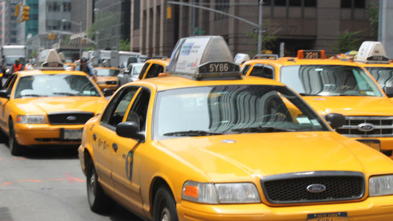

```{r setup, include=FALSE}
knitr::opts_chunk$set(echo = TRUE)
```

## History

<center></center>

<head>  
  <style>  
    p { text-indent: 2.0em;}  
  </style>  
</head>
<p>
The New York City <b>Taxi and Limousine Commission (NYC TLC)</b> is a New York City government agency that licenses and regulates the medallion taxis and for-hire vehicle industries, including app-based companies such as Lyft and Uber. The [NYC TLC](https://www1.nyc.gov/site/tlc/index.page) requires reporting of various information, such as pickup locations and fares, which is used internally to help the NYC TLC develop policies. This [data](https://www1.nyc.gov/site/tlc/about/data.page) is made available to the public. Our team was interesting in using this data for one thing, to see where people are going on Valentine's Day. Where are the hot places to take a date? Or spend an evening drinking or dancing? We explored the data to see where people are going and to see how far they are willing to travel to enjoy their night out.
</p>

<center>  </center>
